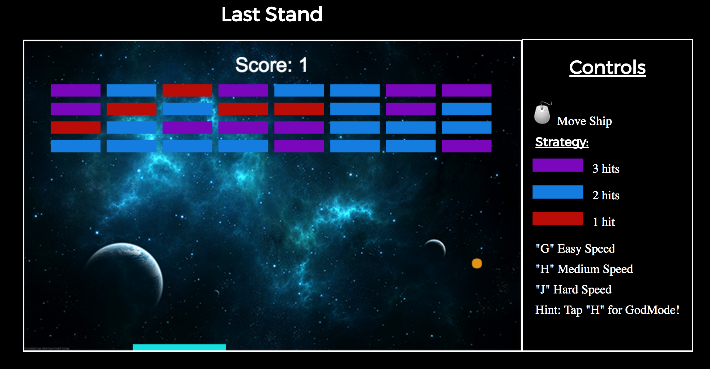

# Last Stand

[Live Link](https://hfeger4.github.io/LastStand/)

## Background

Last Stand is a take on the classic 1986 arcade game Arkanoid. In the game, a layer of bricks lines the top half of the screen. A ball of energy travels across the screen, bouncing off the top and walls but destroying any bricks it comes into contact with. The player loses a turn when the ball touches the bottom of the screen, which can be prevented by using the ship to shield it. The level is won when there are no bricks remaining.



## Features and Implementation

### Technology

Last Stand was written in pure `Javascript`, styled with `CSS`, and drawn on an `HTML Canvas`.

### Visuals

The visuals for the arcade portion of the game are all rendered on an HTML Canvas. Initially, there was a problem with stutter and frame skips as the ball moved across the screen. Utilizing `requestAnimationFrame` instead of `setInterval`, I was able to produce higher quality animation that completed eliminated the flicker and shear that can happen when using `setInterval`.

### Collision

Collision in Last Stand works by comparing the `X` and `Y` positions of items, coupled with their width, heights, and radii, to change the direction of the ball on impact.

``` ruby
let allBricks = this.bricks.myFlatten();
allBricks.forEach(oneBrick => {
  if (oneBrick.hits > 0){
    if (this.ballY >= oneBrick.y &&
        this.ballX >= oneBrick.x &&
        this.ballY <= oneBrick.y + this.brickHeight &&
        this.ballX <= oneBrick.x + this.brickWidth){
          this.yBounce();
```


## New Features

New features planned for the future include many of the power-ups that the original Arkanoid contained. This includes multiple balls power-up, increased paddle length power-up, and the ability to fire a laser from the ship.
