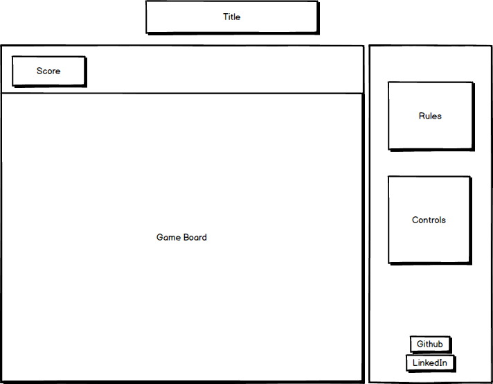

# Last Stand

## Background
Last Stand is a take on the classic 1986 arcade game Arkanoid. In the game, a layer of bricks lines the top half of the screen. A ball of energy travels across the screen, bouncing off the top and walls but destroying any bricks it comes into contact with. The player loses a turn when the ball touches the bottom of the screen, which can be prevented by using the ship to shield it. The level is won when there are no bricks remaining.

## Functionality and MVP
- Start, pause, and reset the game board
- Move the ship using the keyboard or mouse
- Bricks populate and are destroyed when hit, sturdier bricks can take more hits.
- Ball is deflected when it makes contact with the walls, ship, and bricks.
- Production README
- BONUS: Arkanoid PowerUps- Special bricks release multiple balls, increase the width of the ship, or effect the speed of the ball.

## Wireframe
The app will consist of a single screen with instructions, game board, and score. The game will take up most of the middle screen, with game controls listed to the right.

## Architecture and Technologies

### Technologies
- `Webpack` to bundle and use scripts.
- Vanilla `JavaScript` and `JQuery` for structure and game logic.
- `Easel.js` with `HTML5 Canvas` for DOM Manipulation and rendering.

### Architecture
- board.js: The creation of the game board and it's bricks.
- ball.js: The ball bouncing physics as well as the logic for it's movement.
- ship.js: The creation and movement of the paddle.
- game.js: Overall game logic and setup.

## Implementation

- Day 1: Set up the initial Node modules, webpack configuration, skeleton setup for JavaScript files, review and learn Canvas and Easel.

- Day 2: Continue learning Easel and Canvas. Create the board, ball, and paddle for the game. Implement the logic for ball physics, paddle movement and reflection.

- Day 3: Set up the bricks and the logic for their destruction. Be able to start, pause, and announce when the player wins.

- Day 4: Create control and rule instructions. Style the frontend to be polished and professional.

## Bonus Features
There are many different variations of this game that use different powerups.
- Special bricks release multiple balls, increase the width of the ship, or effect the speed of the ball.
- Playable music and sound effects for the ball interaction.
- Different themes for the background.
